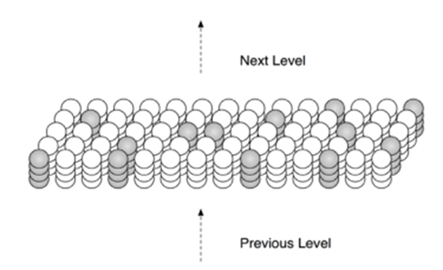

# Temporal Memory

Temporal memory is an algorithm which learns sequences of Sparse Distributed Representations (SDRs) formed by the Spatial Pooling algorithm, and makes predictions of what the next input SDR will be.

Temporal memory alogirithm's input is the active columns output of Spatial Pooler algorithm.

## Parameter description

| Parameter                   | Description                                                                                                                                                              |
| --------------------------- | ------------------------------------------------------------------------------------------------------------------------------------------------------------------------ |
| CELLS_PER_COLUMN            | Number of cells per columns in the SDR                                                                                                                                   |
| ACTIVATION_THRESHOLD        | The activation threshold of a segment. If the number of active connected synapses on a distal segment is at least this threshold, the segment is declared as active one. |
| LEARNING_RADIUS             | Radius around cell from which it can sample to form distal connections.                                                                                                  |
| MIN_THRESHOLD               | If the number of synapses active on a segment is at least this threshold, it is selected as the best matching cell in a bursting column.                                 |
| MAX_NEW_SYNAPSE_COUNT       | The maximum number of synapses added to a segment during learning.                                                                                                       |
| MAX_SYNAPSES_PER_SEGMENT    | The maximum number of synapses that can be added to a segment.                                                                                                           |
| MAX_SEGMENTS_PER_CELL       | The maximum number of Segments a Cell can have.                                                                                                                          |
| INITIAL_PERMANENCE          | Initial permanence value for a synapse.                                                                                                                                  |
| CONNECTED_PERMANENCE        | If the permanence value for a synapse is ≥ this value, it is “connected”.                                                                                                |
| PERMANENCE_INCREMENT        | If a segment correctly predicted a cell’s activity, the permanence values of its active synapses are incremented by this amount.                                         |
| PERMANENCE_DECREMENT        | If a segment correctly predicted a cell’s activity, the permanence values of its inactive synapses are decremented by this amount.                                       |
| PREDICTED_SEGMENT_DECREMENT | If a segment incorrectly predicted a cell’s activity, the permanence values of its active synapses are decremented by this amount.                                       |

The Temporal Memory can be initialized as follow:
```cs
public void TemporalMemoryInit()
{
    HtmConfig htmConfig = Connections.GetHtmConfigDefaultParameters();
    Connections connections = new Connections(htmConfig);

    TemporalMemory temporalMemory = new TemporalMemory();

    temporalMemory.Init(connections);
}
```

Similar to Spatial Pooler, Temporal memory has a same method to calculate the output [SDR](./SdrRepresentation.md): `tm.Compute(int[] activeColumns, bool learn)`. This method takes the result of active columns in the stable output SDR from the Spatial Pooler (training is off) with learning option to produce a `ComputeCycle` object which holds the information of winner cells and predictive cells.

```cs
public ComputeCycle Compute(int[] activeColumns, bool learn)
```

Temporal Memory algorithm predicts what the next input SDR will be based on sequences of Sparse Distributed Representations (SDRs) produced by the Spatial Pooling algorithm. Each column in the SDR consists of many cells. Each cell can have three states: active, predictive, and inactive. These cells should have one proximal segment and many distal dendrite segments. The proximal segment is the connection of its the column and several bits in the input space. The distal dendrite segments represent the connection of the cell to nearby cells. When a certain input is fed into the HTM system with no prior state or there is no context of the input, every cell in the active column is active. This is called bursting (see **Fig.1**). With the prior state, the algorithm will choose winner cell for each column based on the context of the previous input. From these winner cells, other cells will have the predictive state when the connections to the current active cells in the distal segment of those cells reach a certain value of ACTIVATION_THRESHOLD.

<figure>
<p align="center">

</p>
<figcaption align = "center"><b>Fig.1 - SDR bursting</b></figcaption>
</figure>

With learning is turned on, if the predictive cells become active in the next input, the permanence values of its active synapses will be incremented, and its inactive ones will be diminished. However, if the system predicts some wrong cells, the cells’ active synapses will be punished as their synaptic permanence is reduced. Without learning, there are no change in the synapses of the segments.

The following code illustrates how to start using Temporal Memory to learn a sequence:
```cs
List<int[]> activeColumnsList = new List<int[]>(); // This activeColumns are the SpatialPooler output SDRs in short form
for (int i = 0; i < maxCycles; i++)
{
    foreach (var activeColumns in activeColumnsList)
    {
        ComputeCycle cc = tm.Compute(activeColumns, learn: true);
        // ComputeCycle contain the information of ActiveCells, WinnerCells and PredictiveCells which can be used to aggregate the result of the learning process
    }
}

```

Bellow is an example unit test illustrates how to use `TemporalMemory` algorithm.

```cs
public void TestBurstUnpredictedColumns1()
{
    HtmConfig htmConfig = GetDefaultTMParameters();
    Connections cn = new Connections(htmConfig);

    TemporalMemory tm = new TemporalMemory();

    tm.Init(cn);

    int[] activeColumns = { 0 };
    ISet<Cell> burstingCells = cn.GetCellSet(new int[] { 0, 1, 2, 3 });

    ComputeCycle cc = tm.Compute(activeColumns, true) as ComputeCycle;

    Assert.IsTrue(cc.ActiveCells.SequenceEqual(burstingCells));
}
```

Further unit tests can be found [here](../UnitTestsProject/TemporalMemoryTests.cs)

To interpret the Temporal Memory output, a classifier is utilized to match the input to the predicted SDR result. This classifier includes an algorithm for comparing the SDR output of various input sequences and storing them as key value pairs. The classifier, as shown in Fig. 4, is the last component in the HTM system that allows it to be employed in many prediction applications. 

The following code snippet demonstrates the use of HtmClassifier:

```cs
HtmClassifier<string, ComputeCycle> cls = new HtmClassifier<string, ComputeCycle>();
for (int i = 0; i < maxCycles; i++)
{
    foreach (var activeColumns in activeColumnsList)
    {
        ComputeCycle cc = tm.Compute(activeColumns, learn: true);

        // The input label is captured during the encoding phase
        cls.Learn(input, cc.PredictiveCells);
    }
}
```

Further explaination of HtmClassifier can be found [here](./htm-classifier.md)


## How to use Temporal Memory

The usage of Temporal Memory is demonstrated in the method `RunMultiSequenceLearningExperiment` in [Program.cs](../Samples/NeoCortexApiSample/Program.cs) and [MultiSequenceLearning.cs](../Samples/NeoCortexApiSample/MultiSequenceLearning.cs) in NeoCortexApiSample project.

For this example, two sequences of scalar values from 0 to 20 is chosen as the input to the HTM pipeline.
```cs
Dictionary<string, List<double>> sequences = new Dictionary<string, List<double>>();

sequences.Add("S1", new List<double>(new double[] { 0.0, 1.0, 2.0, 3.0, 4.0, 2.0, 5.0, }));
sequences.Add("S2", new List<double>(new double[] { 8.0, 1.0, 2.0, 9.0, 10.0, 7.0, 11.00 }));
```

We start the example by creating an instance of `MultiSequenceLearning` and call the method `Run(Dictionary<string, List<double>> sequences)`. This will produce a predictor based on the input sequences. Detail on how the Run method will be discussed later.

```cs
MultiSequenceLearning experiment = new MultiSequenceLearning();
var predictor = experiment.Run(sequences);
```

In the end, the predictor are given some test values and the prediction is made. 
```cs
var list1 = new double[] { 1.0, 2.0, 3.0 };
var list2 = new double[] { 2.0, 3.0, 4.0 };
var list3 = new double[] { 8.0, 1.0, 2.0 };

predictor.Reset();
PredictNextElement(predictor, list1);

predictor.Reset();
PredictNextElement(predictor, list2);

predictor.Reset();
PredictNextElement(predictor, list3);
```
It will predict which sequence that the value belong to and which value is likely to come after that. The result is logged in the Debug console.
```cs
private static void PredictNextElement(HtmPredictionEngine predictor, double[] list)
{
    Debug.WriteLine("------------------------------");

    foreach (var item in list)
    {
        var res = predictor.Predict(item);

        if (res.Count > 0)
        {
            foreach (var pred in res)
            {
                Debug.WriteLine($"{pred.PredictedInput} - {pred.Similarity}");
            }

            var tokens = res.First().PredictedInput.Split('_');
            var tokens2 = res.First().PredictedInput.Split('-');
            Debug.WriteLine($"Predicted Sequence: {tokens[0]}, predicted next element {tokens2[tokens.Length - 1]}");
        }
        else
            Debug.WriteLine("Nothing predicted :(");
    }

    Debug.WriteLine("------------------------------");
}
```

We can now dig deeper into the function `Run(...)`. The method begins with the process to pretrain the `SpatialPooler` in the HTM pipeline with the two input sequences to get into the stable state in which it is able to represent each individual inputs in the sequences by a unique SDR. This is already described in the [example](./SpatialPooler.md#how-to-use-spatial-pooler) of `SpatialPooler`.

`TemporalMemory` is then initialized with the following code:

```cs
var mem = new Connections(cfg);

CortexLayer<object, object> layer1 = new CortexLayer<object, object>("L1");

TemporalMemory tm = new TemporalMemory();
tm.Init(mem);

layer1.HtmModules.Add("tm", tm);
```

For each sequence, the `SpatialPooler` and `TemporalMemory` algorithm will be executed for at most 3500 cycles. 
```cs
foreach (var sequenceKeyPair in sequences)
{
    Debug.WriteLine($"-------------- Sequences {sequenceKeyPair.Key} ---------------");

    int maxPrevInputs = sequenceKeyPair.Value.Count - 1;

    ...

}
```
In every cycle, single value from the sequence is sequentially presented to the algorithm by calling `layer1.Compute(input, true) as ComputeCycle`. 

```cs
for (int i = 0; i < maxCycles; i++)
{
    matches = 0;

    cycle++;

    Debug.WriteLine("");

    Debug.WriteLine($"-------------- Cycle {cycle} ---------------");
    Debug.WriteLine("");

    foreach (var input in sequenceKeyPair.Value)
    {
        Debug.WriteLine($"-------------- {input} ---------------");

        var lyrOut = layer1.Compute(input, true) as ComputeCycle;

        var activeColumns = layer1.GetResult("sp") as int[];

        ...
    }
}
```

In addition, a HTM classifier is put in place to interpret and aggregate the result so that a sequence will be classified to a SDR with unique active columns and cells.

```cs
HtmClassifier<string, ComputeCycle> cls = new HtmClassifier<string, ComputeCycle>();

...

cls.Learn(key, actCells.ToArray());
```
Each key that the classifier used is formulated from the previous inputs from the current input and the sequence name.

The number of match prediction is also documented

After each learning cycle, the learning accuracy is calulated. Based on this result, the learning cycle will be ended early if the algorithm successfully predict the input for at least 30 cycles consecutively.
Otherwise, the algorithm will be performed until the maximum cycle is reached and the predictor from such case is unstable and cannot be used for the prediction process. This is hardly the case as the cycle limit is usually a large number (at least 1000).
```cs
if (accuracy >= maxPossibleAccuraccy)
{
    maxMatchCnt++;
    Debug.WriteLine($"100% accuracy reched {maxMatchCnt} times.");

    //
    // Experiment is completed if we are 30 cycles long at the 100% accuracy.
    if (maxMatchCnt >= 30)
    {
        sw.Stop();
        Debug.WriteLine($"Sequence learned. The algorithm is in the stable state after 30 repeats with with accuracy {accuracy} of maximum possible {maxMatchCnt}. Elapsed sequence {sequenceKeyPair.Key} learning time: {sw.Elapsed}.");
        break;
    }
}
```