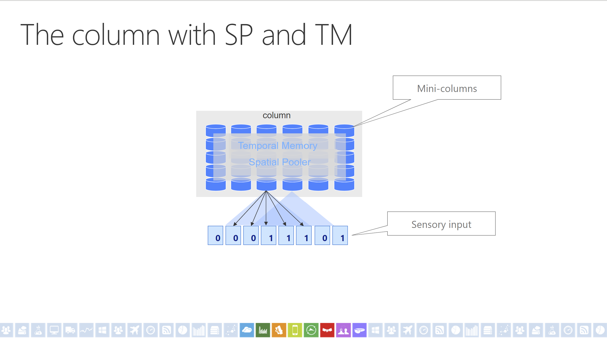
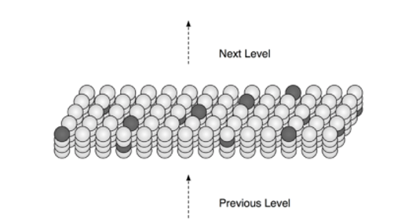
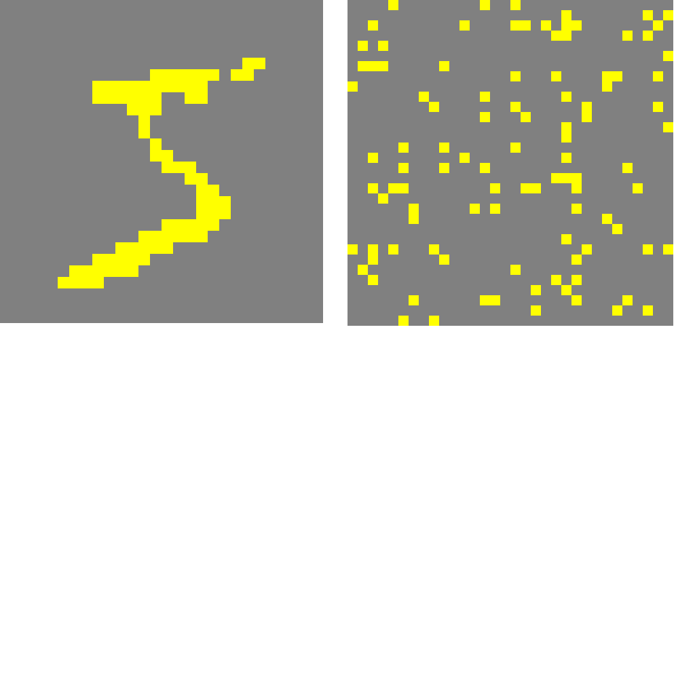

# Getting started

## HTM

The Hierarchical Temporal Memory Cortical Learning Algorithm (HTM CLA) is a theory and machine learning technology that aims to capture cortical algorithm of the neocortex.

HTM consists of 2 different components: Spatial Pooler and Temporal Memory. The concept of HTM is illustrated in the following image. Inside the algorithms, there are multiple mini columns act as synapses in our brain. These columns will be activated or deactivated depend on the input that is given. This is similar to the synapse activity. HTM, like many other machine learning algorithm, only deals with number. Therefore, it requires an encoder to transform the real world concept into digitized world of '0's and '1's.

<p align="center">
    
</p>

<!--  -->

First, input is given as a list.

```cs
int inputBits = 100;
double max = 20;
int numColumns = 2048;
List<double> inputValues = new List<double>(new double[] { 0.0, 1.0, 0.0, 2.0, 3.0, 4.0, 5.0, 6.0, 5.0, 4.0, 3.0, 7.0, 1.0, 9.0, 12.0, 11.0, 12.0, 13.0, 14.0, 11.0, 12.0, 14.0, 5.0, 7.0, 6.0, 9.0, 3.0, 4.0, 3.0, 4.0, 3.0, 4.0 });
int numInputs = inputValues.Distinct().ToList().Count;
var inputs = inputValues.ToArray();
```

## Sparse Distributed Representations

Even though neurons in the neocortex are extensively linked, inhibitory neurons ensure that only a small fraction of neurons are active at any given moment. As a result, in the brain, information is always expressed by a small proportion of activated neurons within a huge population of neurons. A "sparse distributed representation" is the name given to this type of encoding. The term "sparse" refers to the fact that only a tiny fraction of neurons is activated at any given moment. The term "distributed" refers to the fact that numerous neurons must be activated to express anything. To express the whole message, a single activated neuron must be evaluated within the context of other neurons.

As illustrated in Fig. 1, an SDR is a large array of bits, the majority of which are turned off (0s) and just a few are switched on (1s). As two SDRs are deemed to have comparable meaning if they have numerous overlapping locations of on bits, each in SDR represents some meaning. The more bits they share, the more comparable the data or the less the gap between two SDRs.

<figure>
<p align = "center">

</p>
<figcaption align = "center"><b>Fig.1 Sparse Distributed Representations</b></figcaption>
</figure>

</br></br>
An SDR is made up of thousands of bits, with a small percentage of them being 1's and the remainder being 0's at any given time.
An SDR's bits correlate to brain neurons, with a 1 indicating a relatively active neuron and a 0 indicating a comparatively inactive neuron.
SDRs' most crucial feature is that each bit has meaning and as a result, the set of active bits in any given representation conveys the collection of semantic properties of the thing being represented. 

[See more in SdrRepresentation.md](./SdrRepresentation.md)

## Encoder

Encoder is chosen according to the type of the inputs. There are some encoder available for popular input type:

- Scalar Encoder
- Datetime Encoder
- Boolean Encoder
- Category Encoder
- Geo-Spatial Encoder

In this example, ScalarEncoder is preferred as inputs are all numbers. The encoder is instantiated with predefined settings. The inputs will be encoded as series of '0's and '1's so that the spatial pooler will understand and proceed with its own computation.

```cs
Dictionary<string, object> settings = new Dictionary<string, object>()
{
    { "W", 15},
    { "N", inputBits},
    { "Radius", -1.0},
    { "MinVal", 0.0},
    { "Periodic", false},
    { "Name", "scalar"},
    { "ClipInput", false},
    { "MaxVal", max}
};
EncoderBase encoder = new ScalarEncoder(settings);
```

More detail about encoders: [Encoders.md](./Encoders.md)

## Spatial Pooler

Encoder produces output to be fed into Spatial Pooler algorithm. Type of Spatial Pooler (SP) that is used in this example is the multithreaded version that utilize multicore of the machine to run the spatial pooler algorithm.

```cs
HtmConfig htmConfig = new HtmConfig
{
    Random = new ThreadSafeRandom(42),
    InputDimensions = new int[] { inputBits },
    ColumnDimensions = new int[] { numColumns },
    CellsPerColumn = 25,
    GlobalInhibition = true,
    LocalAreaDensity = -1,
    // further parameters
};
Connections memory = new Connections(htmConfig);
```

Further explaination of parameters configuration can be found in [Spatial Pooler parameter description](./SpatialPooler.md#parameter-desription).

The `HomeostaticPlasticityController` is included in the spatial pooler algorithm to implement the "new born" effect. This effect tracks the learning process of the SP and switches-off the boosting mechanism (new-born effect) after the SP has entered a stable state for all seen input patterns.

```cs
HomeostaticPlasticityController hpa = new HomeostaticPlasticityController(memory, numInputs * 55,
(isStable, numPatterns, actColAvg, seenInputs) =>
{
    if (isStable)
        // Event should be fired when entering the stable state.
        Debug.WriteLine($"STABLE: Patterns: {numPatterns}, Inputs: {seenInputs}, iteration: {seenInputs / numPatterns}");
    else
        // Ideal SP should never enter unstable state after stable state.
        Debug.WriteLine($"INSTABLE: Patterns: {numPatterns}, Inputs: {seenInputs}, iteration: {seenInputs / numPatterns}");
}, numOfCyclesToWaitOnChange: 25);
```

Initialization of Spatial Pooler

```cs
SpatialPoolerMT spatialPooler = new SpatialPoolerMT(hpa);
spatialPooler.Init(memory, UnitTestHelpers.GetMemory());
```

An example SDR produced by Spatial Pooler algorithm is presented in the Fig.1. The left side shows an MNIST image in binary format and the right side illustrates the SDR output from that image through the Spatial Pooler. In the SDR output, the yellow dots represent the active columns 
<figure>
<p align = "center">

</p>
<figcaption align = "center"><b>Fig.2 SDR of a binarized MNIST image.</b></figcaption>
</figure>

Click [here](./SpatialPooler.md)  to read more about SpatialPooler.

**SDR result**

## Temporal Memory

The output of Spatial Pooler (SDR) is used as the input of Temporal Memory.
Temporal memory algorithm will then learn the temporal pattern from spatial pattern.

Initialization of Temporal Memory can be done similar to Spatial Pooler using `HtmConfig` and `Connection`.

```cs
TemporalMemory temporalMemory = new TemporalMemory();
temporalMemory.Init(mem);
```

See more in: [TemporalMemory.md](./TemporalMemory.md)

## Combine components

After initializing components, they are chained together in `CortexLayer` as HtmModule pipelines in the following order:

<figure>
<p align="center">

</p>
<figcaption align="center"><b>Fig.3 HTM pipeline</b></figcaption>
</figure>

<!-- 

Input &#8594; Encoder &#8594; Spatial Pooler &#8594; Temporal Memory &#8594; Output (`ComputeCycle`) -->

The implementation is demonstrated as follow:

```cs
List<CortexRegion> regions = new List<CortexRegion>();
CortexRegion region0 = new CortexRegion("1st Region");
regions.Add(region0);
CortexLayer<object, object> layer1 = new CortexLayer<object, object>("L1");
region0.AddLayer(layer1);
layer1.HtmModules.Add("encoder", encoder);
layer1.HtmModules.Add("sp", spatialPooler);
layer1.HtmModules.Add("tm", temporalMemory);
bool learn = true;
int maxCycles = 3500;
for (int i = 0; i < maxCycles; i++)
{
    foreach (var input in inputs)
    {
        var lyrOut = layer1.Compute(input, learn) as ComputeCycle;
    }
}
```

[See more here.](./Cortex.md)
