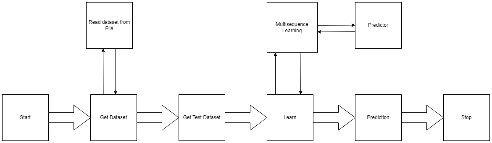
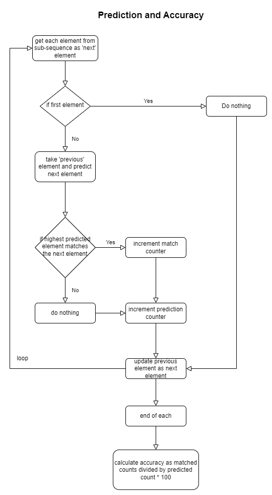
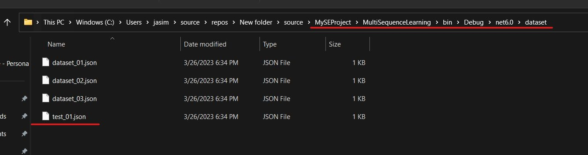
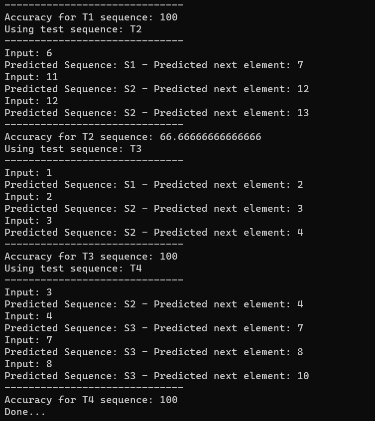

Approve Prediction of Multisequence Learning 

## Introduction
In this project, we have tried to implement new methodologies within the MultisequenceLearning algorithm framework. These methods are designed to autonomously load datasets from a specified path using HelperMethods.ReadDataset(datasetPath). Additionally, we have stored test data in a separate file, which is similarly accessed through HelperMethods.ReadDataset(testsetPath) for subsequent testing of subsequences. The function RunMultiSequenceLearningExperiment(sequences, sequencesTest) is employed to process multiple sequences and test subsequences, received respectively as sequences and sequencesTest. Upon completion of the learning phase, the system calculates the accuracy of the predictions made by the algorithm.

## Implementation



Fig: Schematic Diagram of Approval Prediction in Multisequence Learning Architecture

Above the flow of implementation of our project.

`Sequence` is the model of how we process and store the dataset. And can be seen below:

```csharp
public class Sequence
{
    public String name { get; set; }
    public int[] data { get; set; }
}
```

eg:
- Dataset

```json
[
  {
    "name": "S1",
    "data": [ 0, 2, 5, 6, 7, 8, 10, 11, 13 ]
  },
  {
    "name": "S2",
    "data": [ 1, 2, 3, 4, 6, 11, 12, 13, 14 ]
  },
  {
    "name": "S3",
    "data": [ 1, 2, 3, 4, 7, 8, 10, 12, 14 ]
  }
]
```

- Test Dataset

```json
[
  {
    "name": "T1",
    "data": [ 1, 2, 4 ]
  },
  {
    "name": "T2",
    "data": [ 2, 3, 4 ]
  },
  {
    "name": "T3",
    "data": [ 4, 5, 7 ]
  },
  {
    "name": "T4",
    "data": [ 5, 8, 9 ]
  }
]

```

Our implemented methods are in `HelperMethod.cs` and can be found [here](../HelperMethods.cs):

1. FetchHTMConfig()

Here we save the HTMConfig which is used for Hierarchical Temporal Memory to `Connections`

```csharp
/// <summary>
/// HTM Config for creating Connections
/// </summary>
/// <param name="inputBits">input bits</param>
/// <param name="numColumns">number of columns</param>
/// <returns>Object of HTMConfig</returns>
public static HtmConfig FetchHTMConfig(int inputBits, int numColumns)
{
    HtmConfig cfg = new HtmConfig(new int[] { inputBits }, new int[] { numColumns })
    {
        Random = new ThreadSafeRandom(42),

        CellsPerColumn = 25,
        GlobalInhibition = true,
        LocalAreaDensity = -1,
        NumActiveColumnsPerInhArea = 0.02 * numColumns,
        PotentialRadius = (int)(0.15 * inputBits),
        MaxBoost = 10.0,
        DutyCyclePeriod = 25,
        MinPctOverlapDutyCycles = 0.75,
        MaxSynapsesPerSegment = (int)(0.02 * numColumns),
        ActivationThreshold = 15,
        ConnectedPermanence = 0.5,e.
        PermanenceDecrement = 0.25,
        PermanenceIncrement = 0.15,
        PredictedSegmentDecrement = 0.1,
    };

    return cfg;
}
```

All the fields are self-explanatory as per HTM theory.

2. getEncoder()

We have used `ScalarEncoder` since we are encoding all numeric values only.

Remeber that `inputBits` is same as `HTMConfig`.

```csharp
/// <summary>
/// Get the encoder with settings
/// </summary>
/// <param name="inputBits">input bits</param>
/// <returns>Object of EncoderBase</returns>
public static EncoderBase GetEncoder(int inputBits)
{
        double max = 20;

        Dictionary<string, object> settings = new Dictionary<string, object>()
        {
        { "W", 15},
        { "N", inputBits},
        { "Radius", -1.0},
        { "MinVal", 0.0},
        { "Periodic", false},
        { "Name", "scalar"},
        { "ClipInput", false},
        { "MaxVal", max}
        };

        EncoderBase encoder = new ScalarEncoder(settings);

        return encoder;
}
```

Note that `MaxValue` for the encoder is set to `20` which can be changed but then this value should be matched while creating the synthetic dataset.

3. ReadDataset()

Reads the JSON file when passed as a full path and returns the object of the list of `Sequence`

```csharp
/// <summary>
/// Reads dataset from the file
/// </summary>
/// <param name="path">full path of the file</param>
/// <returns>Object of list of Sequence</returns>
public static List<Sequence> ReadDataset(string path)
{
        Console.WriteLine("Reading Sequence...");
        String lines = File.ReadAllText(path);
        //var sequence = JsonConvert.DeserializeObject(lines);
        List<Sequence> sequence = System.Text.Json.JsonSerializer.Deserialize<List<Sequence>>(lines);

        return sequence;
}
```

4. CreateDataset()

We have advanced our approach to dataset creation by automating the process, eliminating the need for time-consuming manual intervention. In this improved system, datasets are generated based on specified parameters. These include numberOfSequence, which determines the number of sequences to be created; size, which defines the length of each sequence; and startVal and endVal, which set the starting and ending range values for the sequences, respectively. This streamlined method enhances efficiency and accuracy in dataset generation.

```csharp
/// <summary>
/// Creates a list of Sequence as per configuration
/// </summary>
/// <returns>Object of list of Sequence</returns>
public static List<Sequence> CreateDataset()
{
        int numberOfSequence = 3;
        int size = 12;
        int startVal = 0;
        int endVal = 15;
        Console.WriteLine("Creating Sequence...");
        List<Sequence> sequence = HelperMethods.CreateSequences(numberOfSequence, size, startVal, endVal);

        return sequence;
}
```

Note that `endVal` should be less than equal to `MaxVal` of `ScalarEncoder` used above

5. SaveDataset()

Saves the dataset in the `dataset` director of the `BasePath` of the application where it is running.

```csharp
/// <summary>
/// Saves the dataset in the 'dataset' folder in BasePath of the application
/// </summary>
/// <param name="sequences">Object of list of Sequence</param>
/// <returns>Full path of the dataset</returns>
public static string SaveDataset(List<Sequence> sequences)
{
        string BasePath = AppDomain.CurrentDomain.BaseDirectory;
        string reportFolder = Path.Combine(BasePath, "dataset");
        if (!Directory.Exists(reportFolder))
        Directory.CreateDirectory(reportFolder);
        string reportPath = Path.Combine(reportFolder, $"dataset_{DateTime.Now.Ticks}.json");

        Console.WriteLine("Saving dataset...");

        if (!File.Exists(reportPath))
        {
        using (StreamWriter sw = File.CreateText(reportPath))
        {
          sw.WriteLine(JsonConvert.SerializeObject(sequences));
        }
        }

        return reportPath;
}
```

6. Calculating accuracy in PredictNextElement() in `Program.cs`



Fig: Predictions and calculating accuracy

```csharp
int matchCount = 0;
int predictions = 0;
double accuracy = 0.0;

foreach (var item in list)
{
    Predict();
    //compare current element with prediction of previous element
    if(item == Int32.Parse(prediction.Last()))
    {
        matchCount++;
    }
    predictions++;
    accuracy = (double)matchCount / predictions * 100;
}
```

Note that the prediction code is omitted.

## How to run the project

### To create a synthetic dataset

1. Open the [sln](../../../NeoCortexApi.sln) and select `MultiSequenceLearning` as startup project.

2. In `Program.cs` we have the `Main()`. Uncomment the below code to create a synthetic dataset.

```csharp
//to create a synthetic dataset
string path = HelperMethods.SaveDataset(HelperMethods.CreateDataset());
Console.WriteLine($"Dataset saved: {path}");
```

*and comment rest of the lines*.

3. Run to create the dataset and save the path of the dataset folder and name.



### To run the experiment

1. Open the [NeoCortexApi.sln](../../../NeoCortexApi.sln) and select `MultiSequenceLearning` as startup project.

2. In `Program.cs` we have the `Main()`. Change the name of `dataset` file saved from previous run  as seen below:

```csharp
//to read dataset
string BasePath = AppDomain.CurrentDomain.BaseDirectory;
string datasetPath = Path.Combine(BasePath, "dataset", "dataset_03.json"); //edit name of dataset here
Console.WriteLine($"Reading Dataset: {datasetPath}");
List<Sequence> sequences = HelperMethods.ReadDataset(datasetPath);
```

and also *copy the [test data](../dataset/test_01.json) to the folder* (`{BASEPATH}\neocortexapi\source\MySEProject\MultiSequenceLearning\bin\Debug\net6.0\dataset`).

## Results

We have experimented to the maximum feasible extent, utilizing a variety of datasets. To accommodate the considerable execution time, we deliberately limited the size of the datasets and maintained the sequences at a minimal length.


